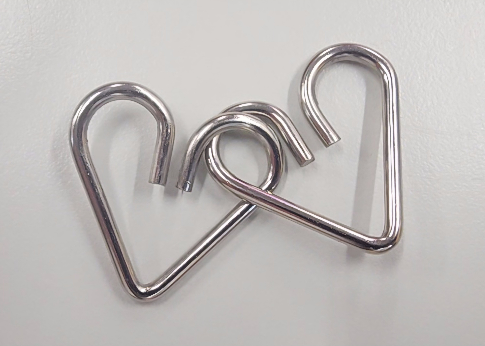
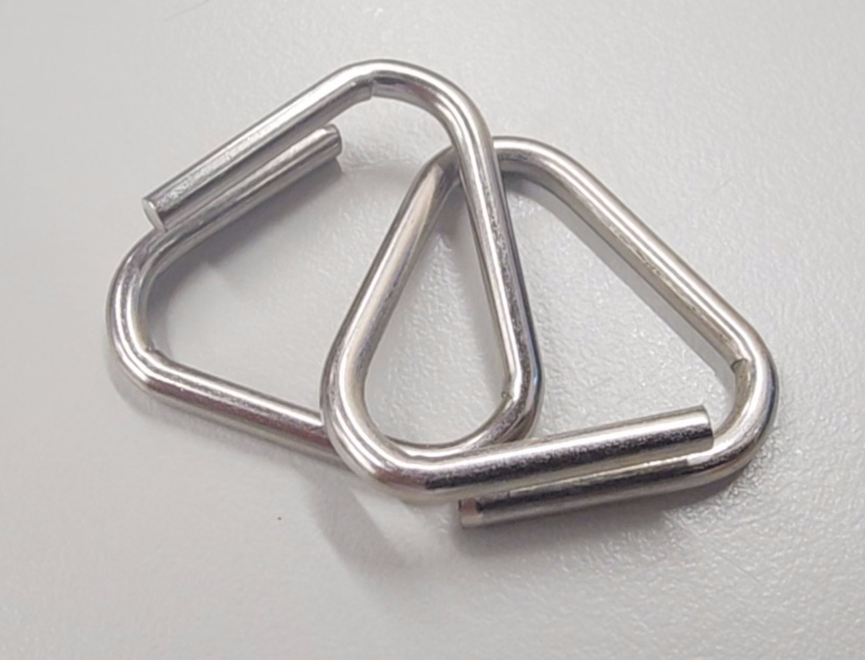
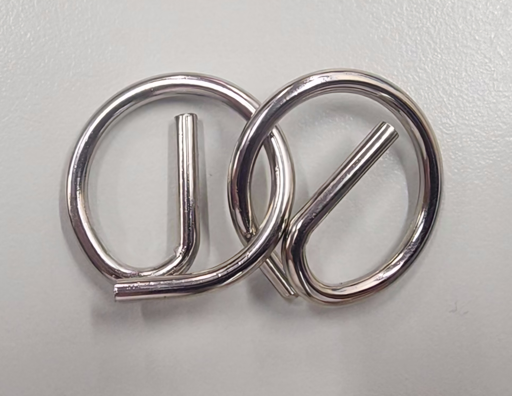
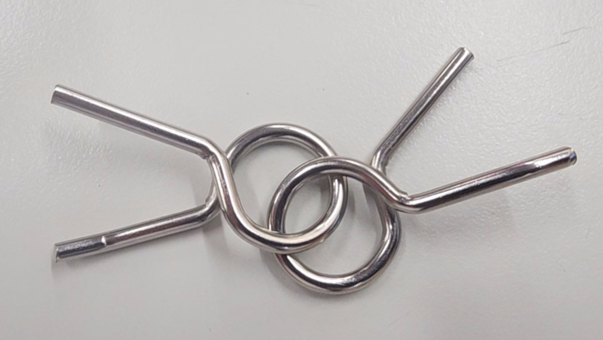

# Tutoriais dos Desafios Realizados
### Feito por: Maria Vitória, Eduarda Scaliz, Guilherme da Conceição e Igor Espósito.
#### Quebra-Cabeças:
#####
- Dois Corações.

<video controls src="Imagens/20240503_145500-1.mp4" title="Title"></video>
- Dois Triângulos.

<video controls src="Imagens/20240503_134337-1.mp4" title="Title"></video>
- Dois G's.

<video controls src="Imagens/20240503_142818-1.mp4" title="Title"></video>
- Dois Bonequinhos.

<video controls src="Imagens/20240503_142137-1.mp4" title="Title"></video>
<video controls src="Imagens/20240503_145750-1.mp4" title="Title"></video>